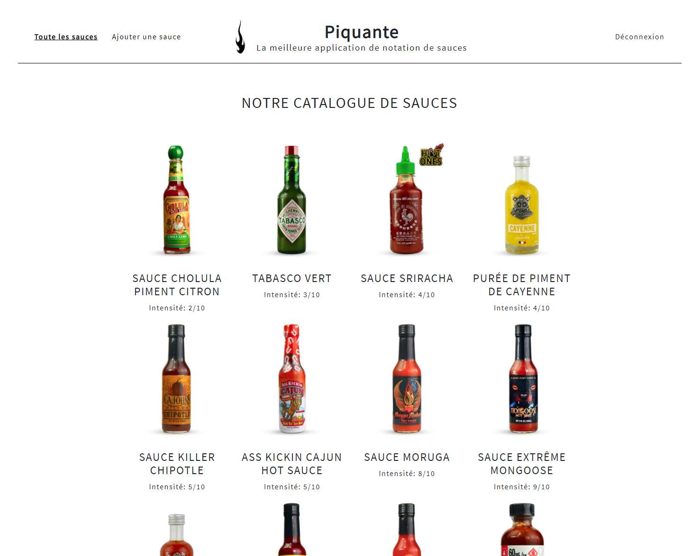

# Backend - Construisez une API sécurisée pour une application d'avis gastronomiques



## Prérequis

* Node.js version ^12.20.2, ^14.15.0 ou ^16.10.0
* npm

## Installation

1. Cloner le dépôt :

   ```bash
   git clone https://github.com/cheikh-mbacke/Construisez-une-API-s-curis-e-pour-une-application-d-avis-gastronomiques_front.git
   cd Construisez-une-API-s-curis-e-pour-une-application-d-avis-gastronomiques_front
   ```

2. Installer les dépendances :

   ```bash
   npm install
   ```

## Lancer le projet en développement

```bash
ng serve
```

Le projet sera accessible sur `http://localhost:4200`.

